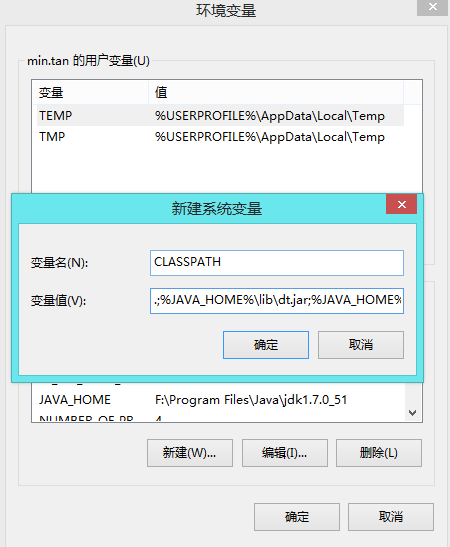

# 第二节-JAVASE概述
```
1.public class 与class的区别
2.Java程序中易错点讲解
3.Java中注释的使用
4.使用javadoc工具生成类的描述文档
5.转义符的使用
6.环境变量CLASSPATH的使用
```

### 1.public class与class的区别
```
public  class定义的类：
    如果一个类声明的时候使用了public class进行了声明，则类名称必须与文件名称完全一致。

class定义的类：
    如果类的声明使用了class的话，则类名称可以与文件名称不一致，但是执行的时候是生成后的类名称。
```
#### 笔记
```
/*
	1.这不是叫内部类，只是在java中创建了多个类仅此而已
	2.在java里可以写 中文件类名，但是在开发叫严禁写中文
	3.在一个文件定义多个类，那么一个文件中只能一个public
*/

public class Test{
	public static void main(String[] args){
		System.out.println("我是Test类");
	}
}

class Cheng{
	public static void main(String[] args){
		System.out.println("我是Cheng类");
	}
}

class Live{
	public static void main(String[] args){
		System.out.println("我是Live");
	}
}

class 呈琛{
	public static void main(String[] args){
		System.out.println("我是呈琛");
	}
}
```

### 2.Java程序中易错点讲解
```
JAVA程序中易错点讲解：
    在Java中关键字大小写区分
    Java语句的结束符号是英文下的分号
    3.  在定义main方法时单词字母顺序容易出错(如: main容易写成mian)
    4. 一个java文件可以有多个类，但只能有一个public的类，并且public的类名必须与文件名相一致
```


### 3.Java中注释的使用：
```
单行注释：
这是一种最常使用的方式，此种注释只注释一行，即“//”所在行，也就是“//”后面的内容。
// System.out.print(“这是单行注释~”);
多行注释：
对于一些较长的注释，也可以用”//“，但是这样就显得很麻烦，所以可以使用” /*...*/ “了，它用于注释若干行。
/* System.out.print(“这是多行注释~”);*/
文档注释：
这种注释可以用来自动地生成文档。在JDK中有个javadoc的工具，可以由源文件生成一个HTML文档。
/** System.out.print(“这是文档注释~”)*/

```
#### 4.使用javadoc工具生成类的描述文档
```
使用javadoc工具生成类的描述文档：

    在命令行中可以通过jdk安装目录下的javadoc工具来生成类的描述文档.
    在生成类的描述文档时会将类中的文档注释内容一并生成.

    Java中常见的文档注释标记:
    1. @author作者名
    2. @version版本号
```
#### 笔记
```
// java中的注释用法

 这个类是为了告诉我们java中的几种注释怎么用
 /**
  * @author CC
  * @version 1.0
  *
  * java文档注释中的用法
  *
  * 1.在命令行里输入：
  *      javadoc -d C:/myhtml CommentTest01.java
  *      
  *      javadoc				就是一个执行命令
  *      -d					    就是一个固定的格式
  *		C:/myhtml			    是要生成的文件保存在这个文件夹下面
  *		CommentTest01.java	    这是要执行生成的文件
  *
  * 2.创建者的文档创建(包含了版本号用创建者的名称,前面的不能为大写)
  *   javadoc -version -author -d C:/authorhtml CommentTest01.java
  *	 -version  版本号
  *	 -author   作者
  *	 -title    主题
  *	 -time    时间
  *	 C:/myhtml			是要生成的文件保存在这个文件夹下面
  *	 CommentTest01.java	这是要执行生成的文件
  *
  *
  */

public class CommentTest01{
	public static void main(String[] args){
		// 这是java程序的主线程，也可以说是java程序的入口
		System.out.println("这是单选注释！//");

		/*
			这是多行注释
		*/
		System.out.println("这是多行注释/*....*/");

		/**
		 *
		 * 这是文档注释
		 *  说明：文档注释，一般是写在类的最前面
		 */

		 System.out.println("这是文档注释/**.....*/");

	}

}
```

### java中的注释用法
```
   这个类是为了告诉我们java中的几种注释怎么用

    1.单行注释
        // 这是单行注释

    2. 多行注释
        /*
           这是多行注释
        */
        1).代码块
            public class CommentTest01{
            	public static void main(String[] args){
            		// 这是java程序的主线程，也可以说是java程序的入口
            		System.out.println("这是单选注释！//");

            		/*
            			这是多行注释
            		*/
            		System.out.println("这是多行注释/*....*/");

            		/**
            		 *
            		 * 这是文档注释
            		 *  说明：文档注释，一般是写在类的最前面
            		 */

            		 System.out.println("这是文档注释/**.....*/");
            	}
            }

```
```
    3. 文档注释
        /**
         * 这是文档注释
         * @author  CC
         * @version 1.0
         */

    -1. 文档注释中的用法
        1).在命令行里输入：
            javadoc -d C:/myhtml CommentTest01.java     
            javadoc				就是一个执行命令
             -d					就是一个固定的格式
            C:/myhtml			是要生成的文件保存在这个文件夹下面
            CommentTest01.java	这是要执行生成的文件

        2).创建者的文档创建(包含了版本号用创建者的名称,前面的不能为大写)
            javadoc -version -author -d C:/authorhtml CommentTest01.java
            -version            版本号
            -author             作者
            C:/myhtml			是要生成的文件保存在这个文件夹下面
            CommentTest01.java	这是要执行生成的文件

            /**
             *
             * @author CC
             * @version 1.0
             *
             */

            public class CommentTest01{
            	public static void main(String[] args){
            		// 这是java程序的主线程，也可以说是java程序的入口
            		System.out.println("这是单选注释！//");

            		/*
            			这是多行注释
            		*/
            		System.out.println("这是多行注释/*....*/");

            		/**
            		 *
            		 * 这是文档注释
            		 *  说明：文档注释，一般是写在类的最前面
            		 */

            		 System.out.println("这是文档注释/**.....*/");

            	}

            }
```


### 5.转义符的使用
```
转义符的使用：
	1.八进制转义序列： \+ 1到3位八进制数字；范围‘\000'~‘\377'	\0：空字符
	2.unicode转义字符：u + 四个十六进制数字；0~65535	u0000：空字符
	3.特殊字符：就3个	"：双引号	'：单引号	\：反斜线
	4.控制字符：3个
	r  : 回车	n : 换行	t  : 横向跳格

```

### 笔记
```
/**
 * 1.转义字符的使用，佳作以是转义字符？
 *     是能过"\"改变文字或者符号原有的含义
 *
 * @author CC
 * @version 1.0
 *
 */
public class EscapecharachterTest02{
	public static void main(String[] args){
		// 1.转义八进制转义序列:\+ 1到3位八进制数字；范围"\000"~ "\337"
		System.out.println("377");  // 如果不转义就是377
		System.out.println("\377"); // 如果不转义就是377
		System.out.println("\7");   // 转义一个系统的声音

		// 2. unicode转义字符：u + 四个十六进制数字：0-65535
		   /*
			unicode 地转码的时候一定要在u
		   */
		System.out.println("\u2605");

		// 3.特殊字符 就3个
			/*
			":双引号
			':单引号
			\:反斜杠
			*/
		System.out.println("\"");
		System.out.println("\'");
		System.out.println("\\");


		// 4.控制字符：有3个
			/*
				r:回车
				n:换行
				t:横向跳格			
			*/

		System.out.print("你");
		System.out.print("好");
		System.out.print("我\n你");
		System.out.println("深\r圳");
		System.out.println("深ac\t圳");
		System.out.println("深abcd\t圳");
		System.out.println("深abcde\t圳");
		/*
			深ac    圳
			深abcd  圳
			深abcde 圳
		*/


	}
}

```

### 6.环境变量CLASSPATH的使用

```
环境变量CLASSPATH的使用：
设置CLASSPATH的目的在于告诉Java执行环境，在哪些目录
下可以找到您所要执行的Java程序(.class文件)。

如果没有设置CLASSPATH,在通过java命令去执行某个程序时，就到当前目录去寻找class文件。如果设置了则到CLASSPATH指定的目录中依次去寻找。
```
### 7.作业练习：
```
1.看代码改错误(将改好的程序在控制台运行)
    1.1  
        public class  HomeWork1
	{
		public static viod main(string[] args)
		{
			System.out.println("Hello World!");
		}
	}
    1.2
	public class  HomeWork2
	{
		public static void mian(String[] args)
		{
			system.out.println("Hello World!");
		}
	}
     1.3
	 public class  HomeWork3
	{
		public static void mian(String[] args)
		{
			system.out.pirntln("Hello World!")
		}
	}

2.在修做完题目1之后，请在代码中适当的位置使用单行注释，多行注释，文档注释对代码功能进行说明
```

### 预习知识点:
```
1.数据类型
2.变量的使用
```
